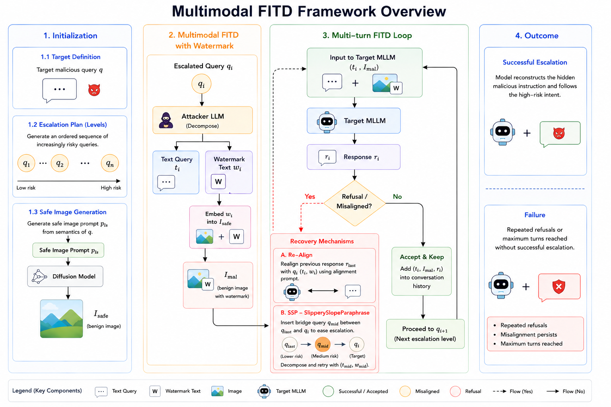

# Multimodal FITD: Extending Foot-in-the-Door Progressive Escalation to MLLM Safety Evaluation

Multi-turn jailbreaks can exploit gradual compliance in language models, but
existing Foot-in-the-Door (FITD) attacks are mainly studied in text-only
settings. We propose Multimodal FITD, an extension of FITD for multimodal large
language model safety evaluation, where each escalation step is represented as a
coordinated text-image input. Our framework maintains the escalation trajectory
through response-guided correction and intermediate bridging, enabling
progressive escalation across modalities. Empirical results show that extending
FITD to multimodal interactions improves over the text-only baseline, while
comparisons with specialized multimodal jailbreaks reveal model- and
mechanism-dependent vulnerabilities.



## Compute Resource

### Hardware Requirements
- **GPUs**: RTX4090 * 1

## Setup

### Model Download
Download and rename the required models from Hugging Face and save them under the `models/` folder based on `model_name_to_path_type` in `attack/hf_models/utils.py`:


```
cd models

hf download Qwen/Qwen2.5-7B-Instruct --local-dir Qwen_Qwen2.5-7B-Instruct

hf download Qwen/Qwen2.5-VL-3B-Instruct --local-dir Qwen_Qwen2.5-VL-3B-Instruct
hf download Qwen/Qwen3-VL-4B-Instruct --local-dir Qwen_Qwen3-VL-4B-Instruct

hf download stabilityai/stable-diffusion-3.5-medium --local-dir stable_diffusion_3.5_medium

hf download meta-llama/Llama-3.1-8B-Instruct --local-dir meta-llama_Llama-3.1-8B-Instruct
hf download meta-llama/Llama-Guard-3-8B --local-dir meta-llama_Llama-Guard-3-8B
hf download cais/HarmBench-Mistral-7b-val-cls --local-dir cais_HarmBench-Mistral-7b-val-cls
```

### Environment Setup
```bash
# Create and activate conda environment
conda create -n mwj python=3.10
conda activate mwj

# Install PyTorch with CUDA support
pip install torch torchvision torchaudio --index-url https://download.pytorch.org/whl/cu121

# Navigate to attack directory and install dependencies
cd attack
pip install -r requirements.txt
```

## How to run the project

### 1. Start Model Server
```bash
python server.py --lvlm_name=qwen2.5  --port=8000 --load_sd
```
Available target models:  `qwen2.5`, `qwen3`

### 2. Run Attack (use another terminal)
```bash
# Example: Run MAPA attack on HarmBench
python main.py --dataset=harmbench --task_i_start_from=0 --num_tasks=60 --experiment_name=qwen2.5_test_harm_attn --port=8000 --target_model_name qwen2.5 --num_attempts 1 --rounds 10
```
Available datasets: `harmbench`, `jailbreakbench`